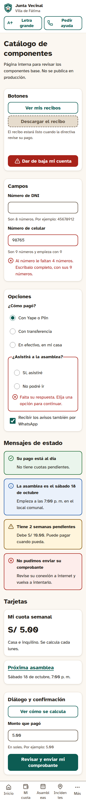
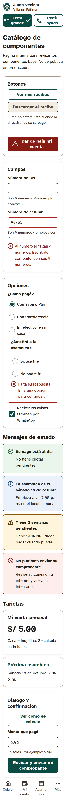
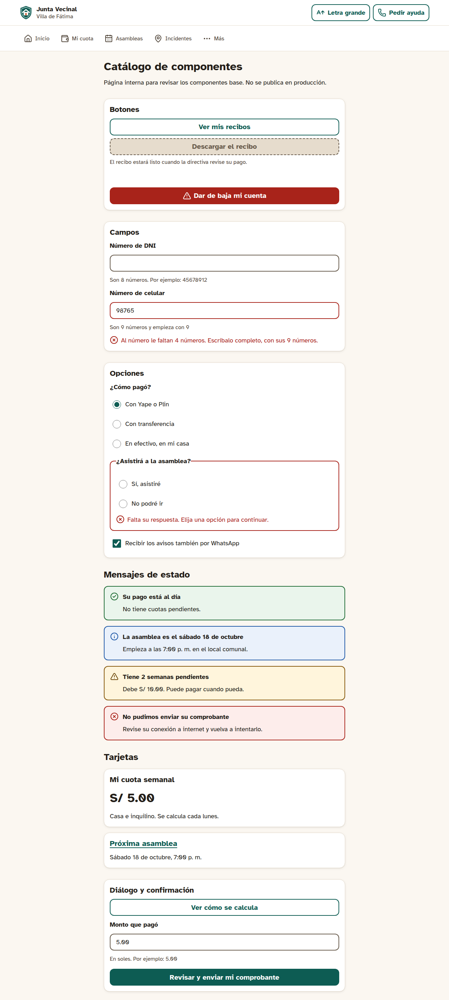
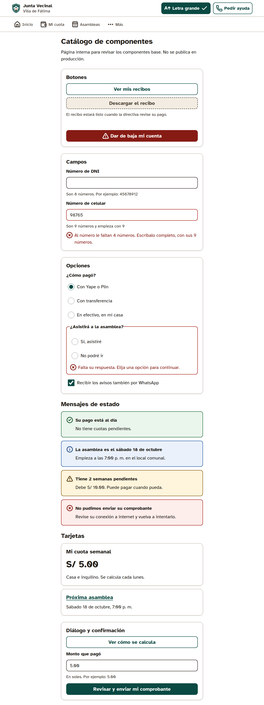
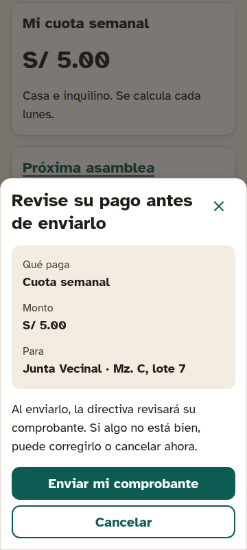
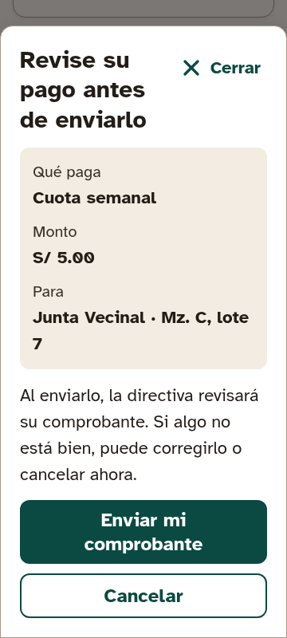
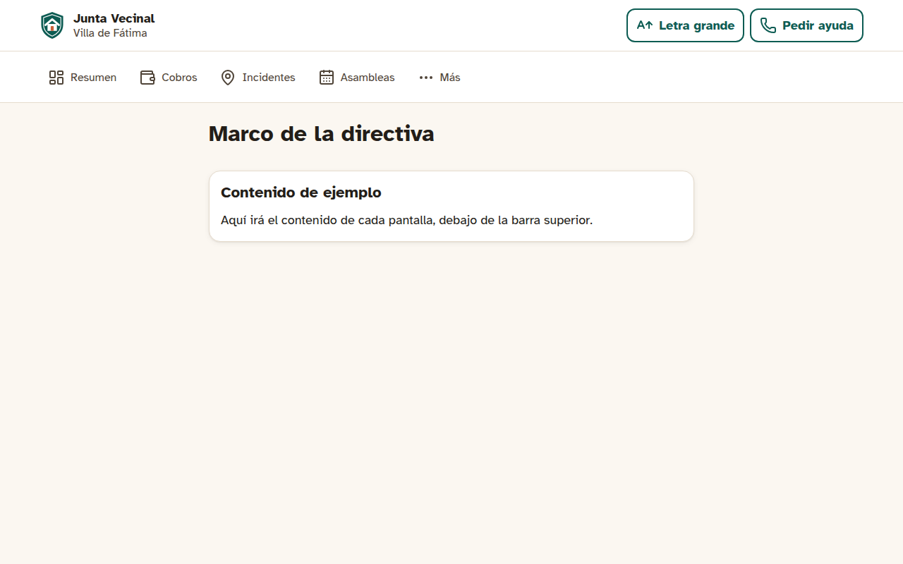
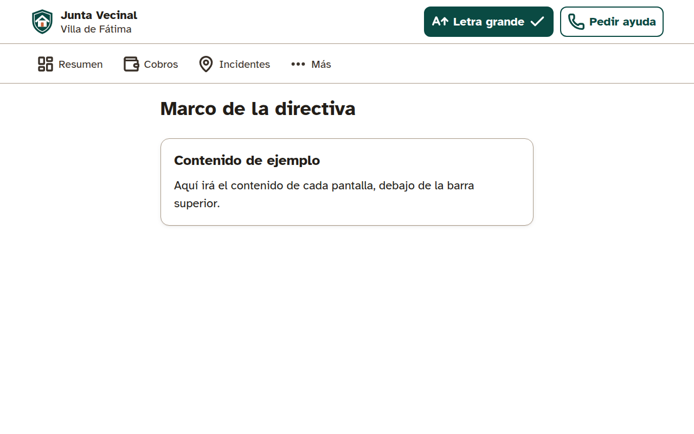
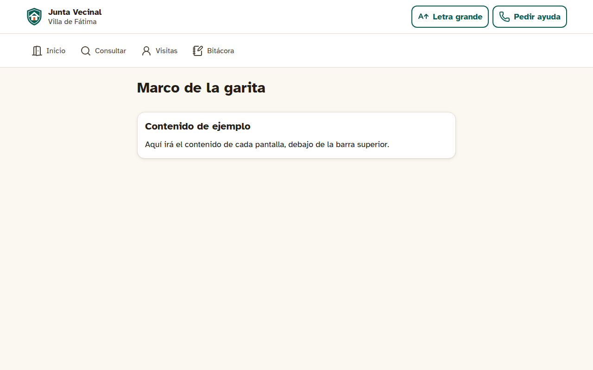
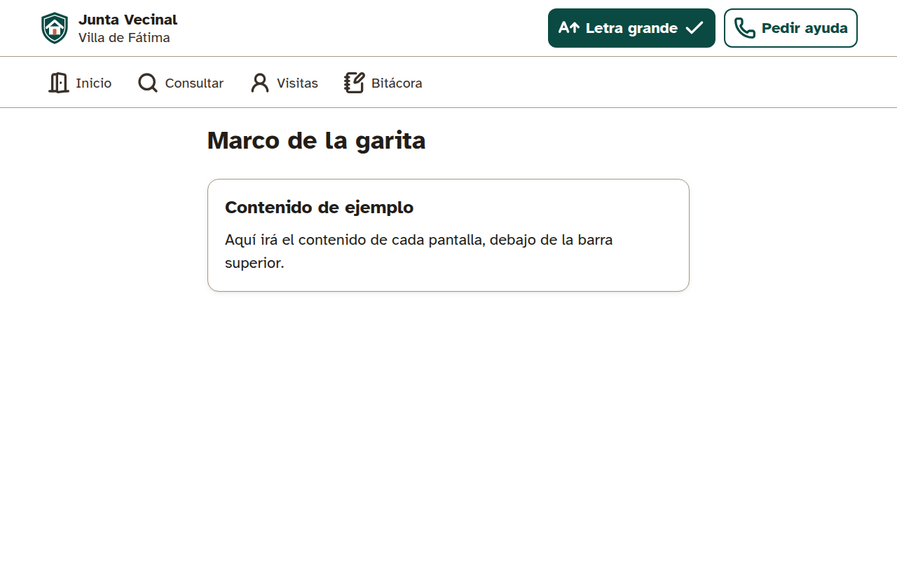

# Evidencia de cierre · Fase 0b Base de accesibilidad (M6) y núcleo compartido

- **Fecha de cierre:** 2026-10-02
- **URL de producción:** <https://juntas-vecinales-eight.vercel.app> (el catálogo responde 404 ahí; existe en local, en el CI y en las previews)
- **Corrida del CI en `main` tras el último merge de código:** [CI #30](https://github.com/FNCRosse/juntas-vecinales/actions/runs/37024564746) (`8e655a2`, PR #9)
- **PR de la fase:** [#5](https://github.com/FNCRosse/juntas-vecinales/pull/5) a [#9](https://github.com/FNCRosse/juntas-vecinales/pull/9) y el de esta evidencia

## 1. HU de la fase

| HU | Estado en el PLAN | PR | Notas |
| --- | --- | --- | --- |
| HU-ACC-03 Confirmación en dos pasos y retroalimentación no punitiva | `[x]` | #6, #9 | `Confirmacion` y mensajes de error de `manejar()`. Cada acción crítica de M1–M5 la usa y la prueba en su e2e |
| HU-ACC-05 Conformidad WCAG 2.2 AA | `[x]` | #5, #9 | axe bloqueante en el CI. CA3 (revisión manual completa y pruebas con personas) y CA4–CA5 (entrar sin recordar una clave, no pedir dos veces un dato) se verifican en las pantallas de M1; la parte con usuarios es de R3.2 |
| HU-ACC-06 Teclado y lector de pantalla | `[x]` | #9 | Ver la nota del §5 sobre Enter en el CI |
| HU-ACC-08 Lenguaje llano | `[x]` | #6, #9 | CA4 (comprensión ≥ 80 % en la prueba con adultos mayores) es manual, R3.2 |
| HU-ACC-09 Área táctil y separación | `[x]` | #5, #9 | CA4 (alternativa al arrastre) se aplica en el mapa de M3 |
| HU-ACC-01 Modo Senior en la cuenta | `[ ]` (M1) | #9 deja la base | Perfil en el servidor y "Letra grande" persistente por dispositivo; lo que falta, en el §7 |

## 2. Cobertura de Jest (unitarias + integración)

Medida en local sobre `main` con 75 pruebas en 15 archivos (el CI exige líneas ≥ 80 %).

| Ámbito | Líneas | Ramas | Funciones |
| --- | ---: | ---: | ---: |
| Global | 98.8 % | 91.7 % | 97.0 % |
| `modulos/accesibilidad/` | 100 % | 100 % | 100 % |
| `compartido/notificaciones/` | 100 % | 100 % | 100 % |
| `compartido/archivos/` | 98.3 % | 85.7 % | 93.8 % |
| `compartido/auditoria/`, `errores.ts`, `manejar.ts` | 100 % | 75–100 % | 100 % |
| `app/api/` | 100 % | 100 % | 100 % |
| `worker/` | 94.4 % | 85.7 % | 87.5 % |

## 3. Matriz HU → código → prueba

Extracto de [`matriz-hu.md`](matriz-hu.md) (`npm run matriz`, que corre en el CI y falla si una HU cerrada no tiene código etiquetado o e2e):

| HU | Código | Unitarias | Integración | E2E |
| --- | --- | --- | --- | --- |
| HU-ACC-03 | `componentes/a11y/Confirmacion.tsx` | `perfilAccesibilidad.test.ts`, `nucleo/manejar.test.ts` | `accesibilidad/perfil.test.ts` | `accesibilidad/confirmacion.cy.ts` |
| HU-ACC-05 | `componentes/tokens/contraste.ts`, `app/catalogo/layout.tsx` | `tokens.test.ts`, `catalogo.test.ts` | — | `accesibilidad/catalogo.cy.ts` |
| HU-ACC-06 | `componentes/a11y/Dialogo.tsx`, `MarcoActor.tsx` | — | — | `accesibilidad/teclado.cy.ts` |
| HU-ACC-08 | `compartido/errores.ts` | `lenguajeLlano.test.ts` | — | `accesibilidad/lenguaje.cy.ts` |
| HU-ACC-09 | `componentes/a11y/Boton.tsx`, `Opcion.tsx` | `tokens.test.ts` | — | `accesibilidad/area-tactil.cy.ts` |

El núcleo, sin HU propia, lleva `@HU-INFRA`: `nucleo/auditoria.test.ts` (AC-6), `nucleo/notificaciones.test.ts` (ADR-006), `nucleo/archivos.test.ts` y `nucleo/whatsapp.test.ts`.

## 4. Reporte axe por pantalla

WCAG 2.2 AA (`wcag2a`, `wcag2aa`, `wcag21a`, `wcag21aa`, `wcag22aa`). Los JSON por pantalla están en el artefacto `reporte-axe` de la corrida del CI (`pruebas/e2e/reportes/axe/<pantalla>-<modo>-<tamaño>.json`).

| Pantalla | Normal 360 × 800 | Normal 1280 × 800 | Senior 360 × 800 | Senior 1280 × 800 |
| --- | ---: | ---: | ---: | ---: |
| Catálogo (`/catalogo`, marco del vecino) | 0 | 0 | 0 | 0 |
| Marco de la directiva (`/catalogo/directiva`) | 0 | 0 | 0 | 0 |
| Marco del administrador (`/catalogo/administrador`) | 0 | 0 | 0 | 0 |
| Marco de la garita (`/catalogo/garita`) | 0 | 0 | 0 | 0 |
| Marco de acceso (`/catalogo/acceso`) | 0 | 0 | 0 | 0 |
| Portada (`/`) | 0 | 0 | 0 | 0 |
| Hoja de confirmación abierta | 0 | — | 0 | — |
| Aviso "No pudimos guardar su preferencia" (1000 × 660) | 0 | — | — | — |

Además, sin scroll horizontal a 360 px en todas las pantallas (WCAG 1.4.10), y objetivos de ≥ 48 px (≥ 56 en Senior) con ≥ 8 px (≥ 12) de separación medidos en el catálogo y en los marcos (`area-tactil.cy.ts`).

## 5. Revisión manual de accesibilidad

Hecha con Chromium y Playwright + axe-core 4.13 sobre el build de producción local, además de los e2e:

- **Teclado:** orden Saltar al contenido → Letra grande → Pedir ayuda → navegación → contenido; contorno de foco de 3 px (4 en Senior) en los 20 controles; al final el foco sale de la página (sin trampas). En el diálogo, el foco queda dentro, Escape lo cierra y el foco vuelve al botón.
- **Enter en un `<button>`:** con Chromium y Playwright, Enter abre el diálogo. En el Electron de Cypress del CI, `cy.press(Enter)` no activa botones (sí enlaces), así que ese e2e llega con Tab y abre con un clic sobre el botón enfocado. Es un límite de la herramienta, no del componente (botón nativo).
- **Hidratación:** antes de que React hidrate, los controles cliente no responden. Es imperceptible en el uso real, pero los e2e lo esperan.
- **Barra inferior a 360 px:** "Asambleas" se parte en dos líneas porque la celda mide unos 64 px. El prototipo hace lo mismo (`hyphens: auto`). Los navegadores con diccionario de español ponen guion; el Chromium de pruebas no. Se revisa con la pantalla real de M1.
- **Pendiente con personas (R3.2):** lector de pantalla (NVDA o TalkBack) en flujos reales, zoom al 200 % con contenido real y pruebas con adultos mayores.

## 6. Capturas

Tomadas sobre el build de producción local con el mismo código de `main`: el catálogo no se publica en producción y la red de esta sesión no alcanza las previews de Vercel.

| Pantalla | Normal | Senior |
| --- | --- | --- |
| Catálogo, teléfono |  |  |
| Catálogo, escritorio |  |  |
| Confirmación en dos pasos, teléfono |  |  |
| Marco de la directiva, escritorio |  |  |
| Marco de la garita, escritorio |  |  |

## 7. Pendientes y decisiones

**Queda por enlazar en M1** (también en el PLAN, bajo HU-ACC-01):

- Llave foránea `accesibilidad_perfiles.usuarioId → Usuario`. Al autenticar, el perfil de la cookie `perfil` pasa al usuario (o se toma el de la cuenta) y `modoSeniorAlRenderizar()` lo lee por la sesión: así se conserva desde otro dispositivo (CA1, R-10).
- El switch "Letra grande" también en Perfil (VEC-ACC-13).
- Los layouts de los grupos exigen sesión y rol. "Pedir ayuda" lleva a la pantalla de HU-ACC-04 (`/mas/ayuda` y equivalentes, hoy sin página).
- `compartido/notificaciones/plantillas.ts` con la primera plantilla (enlace de acceso) y el despertador del worker con `after()`.
- El route handler de subida de archivos, cuando exista la sesión: sin ella, cualquiera podría pedir URLs de subida.

**Decisiones de la fase:**

- La fuente de los tokens es `docs/guia-visual/tokens.json`, no el `tokens.css` del prototipo, que es una versión anterior (FRONTEND.md §4). Una prueba exige que la copia en `componentes/tokens/` sea idéntica.
- Sin `Usuario`, el perfil se guarda en el servidor por dispositivo (cookie `perfil` HttpOnly). Si el guardado falla, el modo se mantiene con la cookie `modo_dispositivo`, nunca con `localStorage`.
- La firma de R2 está escrita a mano (SigV4 con `node:crypto`, validada con el ejemplo de AWS), sin el SDK. Una petición anónima de listado al bucket real responde `400 InvalidArgument: Authorization`.
- `nucleo_cola_avisos` (cola) y `nucleo_notificaciones` (copia interna) son tablas separadas. El reclamo con `SKIP LOCKED` adelanta `reintentarDesde`, así un aviso vuelve solo a la cola si el worker se cae.
- Jest corre los archivos de uno en uno porque las pruebas de integración comparten la BD.
- Diferidos con motivo: PDF etiquetado (`pdf.ts`) a M2 (actas) y la tabla `nucleo_archivos` a M5 (comprobantes), por la regla de no crear nada sin uso real.
- Dependencias nuevas: `zod`, `@radix-ui/react-dialog` y `lucide-react`.
- **Worker en producción:** Render desplegó `8e655a2`; las cuatro migraciones están aplicadas en Neon (`main`) y una ejecución manual del cron (15:11 UTC) registró `EXITOSA` con `{"avisos":{"enviados":0,"sinCanal":0,"reintentos":0,"fallidos":0}}`. **Hallazgo:** el cron programado de GitHub (`*/10`) solo corrió una vez en unas 11 horas: GitHub retrasa o salta los `schedule` en repos nuevos o con poca actividad. Hoy no afecta (no hay avisos reales), pero en M1 el enlace de acceso no puede depender del cron: por eso BACKEND.md §8 prevé el despertador inmediato con `after()`.
- **Límites gratuitos, aviso:** la integración de Vercel con Neon **no borra** la rama de BD de una preview al fusionar el PR. Hoy hay 9 ramas en el proyecto (`main` y 8 previews; 7 son de PR ya cerrados), y el plan Free admite unas 10 por proyecto (valor de referencia, por confirmar en el panel). Con una más, las previews nuevas fallarían. No se borraron por cuenta propia (CLAUDE.md, límites gratuitos): queda pedido a la autora. Por lo demás, unos 25 despliegues de preview en Vercel en el día (límite Hobby de 100 por día) y nada sale a Meta (`WHATSAPP_MODO=simulador` en Render).
