# Evidencia de cierre · M2 Transparencia y rendición de cuentas

- **Fecha de cierre:** 2026-10-03
- **URL de producción:** <https://juntas-vecinales-eight.vercel.app>. La red de esta sesión no la alcanza, así que las capturas y el reporte axe se tomaron sobre el build de producción local con el mismo código de `main` (`4d71cdf`).
- **Corrida del CI en `main` tras el último merge de código:** [CI #98](https://github.com/FNCRosse/juntas-vecinales/actions/runs/37098152669) (`4d71cdf`, PR #34)
- **PR del módulo:** [#30](https://github.com/FNCRosse/juntas-vecinales/pull/30) a [#34](https://github.com/FNCRosse/juntas-vecinales/pull/34), el de mantenimiento [#29](https://github.com/FNCRosse/juntas-vecinales/pull/29) y el de esta evidencia

## 1. HU del módulo

| HU | Estado en el PLAN | PR | Notas (partes diferidas y a qué módulo) |
| --- | --- | --- | --- |
| HU-ASA-15 Comunicados generales y feed comunitario | `[x]` | #30 | El aviso llega solo al centro de avisos: no hay plantilla de WhatsApp para noticias (ver §7) |
| HU-ACC-02 Escuchar en voz alta los comunicados del feed | `[x]` | #31 | Web Speech API del navegador; sin voz en español no se muestra el botón y se explica por qué |
| HU-ASA-11 Acta digital en PDF y su publicación | `[x]` | #32 | La confirmación de la directiva es la aprobación; sin borradores (ver §7). El PDF se genera al pedirlo |
| HU-ASA-10 Balance de ingresos y egresos de actividades pro fondos | `[x]` | #33 | Primer uso real de R2: comprobantes con URL firmada. Sin M4 la actividad se identifica por nombre y fecha |
| HU-ASA-12 Historial público de actas y balances | `[x]` | #34 | Una sola lista por fecha del evento |
| HU-COB-14 Balance agregado y anonimizado de la recaudación | `[-]` | — | Diferida a **M5**: necesita cuotas y pagos |
| HU-COB-15 Exportar la recaudación a CSV | `[-]` | — | Diferida a **M5**: necesita cuotas y pagos |

## 2. Cobertura de Jest (unitarias + integración)

Medida en local sobre `main` (`4d71cdf`), con 278 pruebas en 44 archivos. El CI exige líneas ≥ 80 %.

| Ámbito | Líneas | Ramas | Funciones |
| --- | ---: | ---: | ---: |
| Global | 96.2 % | 85.1 % | 96.4 % |
| `modulos/transparencia/` | 98.5 % | 92.0 % | 100 % |
| `modulos/accesibilidad/` | 97.7 % | 90.0 % | 97.9 % |
| `modulos/identidad/` | 96.3 % | 83.0 % | 97.3 % |
| `compartido/` | 97.2 % | 92.0 % | 93.7 % |
| `app/` (route handlers) | 93.9 % | 77.8 % | 92.1 % |
| `worker/` | 94.7 % | 85.7 % | 87.5 % |

## 3. Matriz HU → código → prueba

[`matriz-hu.md`](matriz-hu.md) (`npm run matriz`): 38 HU listadas, 33 cerradas o en parte, las 33 con e2e.

| HU | Código (caso de uso) | Unitarias | Integración | E2E |
| --- | --- | --- | --- | --- |
| HU-ASA-15 | `transparencia/aplicacion/comunicados.ts`, `avisarComunidad.ts`, `identidad/aplicacion/comunidad.ts` | `comunicado.test.ts` | `comunicados.test.ts` | `comunicados.cy.ts` |
| HU-ACC-02 | `accesibilidad/aplicacion/cambiarSintesisVoz.ts`, `sintesisVoz.ts` | `sintesisVoz.test.ts` | `accesibilidad/perfil.test.ts` | `escuchar.cy.ts` |
| HU-ASA-11 | `transparencia/aplicacion/actas.ts`, `compartido/archivos/pdf.ts` | `acta.test.ts` | `actas.test.ts` | `actas.cy.ts` |
| HU-ASA-10 | `transparencia/aplicacion/balances.ts`, `compartido/archivos/registro.ts`, `compartido/dinero.ts` | `balance.test.ts`, `dinero.test.ts` | `balances.test.ts`, `nucleo/archivos.test.ts` | `balances.cy.ts` |
| HU-ASA-12 | `transparencia/aplicacion/historial.ts` | `historial.test.ts` | `historial.test.ts` | `historial.cy.ts` |

Todas las publicaciones comparten tres garantías, cada una con prueba: inalterables (el trigger de la base rechaza `UPDATE` y `DELETE`), idempotentes por `idOperacion` (AC-5) y auditadas en la misma transacción (AC-6).

## 4. Reporte axe por pantalla

WCAG 2.2 AA (`wcag2a`, `wcag2aa`, `wcag21a`, `wcag21aa`, `wcag22aa`), axe-core sobre el build de producción local a 360 × 800, con datos ficticios. Los e2e del CI repiten la revisión en cada paso de los flujos (errores, confirmación y éxito).

| Pantalla | Ruta | Normal | Senior | Scroll horizontal |
| --- | --- | ---: | ---: | --- |
| DIR-INI-01 Resumen de la directiva | `/directiva` | 0 | 0 | no |
| DIR-ASA-14 Comunicado a la comunidad · paso 1 de 2 | `/directiva/comunicados/nuevo` | 0 | 0 | no |
| DIR-ASA-15 Comunicado · paso 2 de 2 | `/directiva/comunicados/nuevo (paso 2)` | 0 | 0 | no |
| DIR-ASA-10 Acta de la asamblea · paso 1 de 2 | `/directiva/actas/nueva` | 0 | 0 | no |
| DIR-ASA-11 Publicar acta · paso 2 de 2 | `/directiva/actas/nueva (paso 2)` | 0 | 0 | no |
| DIR-ASA-12 Balance de una actividad (ingresos, gastos y gráfico) | `/directiva/balances/nuevo` | 0 | 0 | no |
| DIR-ASA-13 Publicar balance · paso 2 de 2 | `/directiva/balances/nuevo (paso 2)` | 0 | 0 | no |
| VEC-ACC-09 Inicio (últimas noticias) | `/` | 0 | 0 | no |
| VEC-TRA-04 Noticias de la junta (con lectura en voz) | `/noticias` | 0 | 0 | no |
| VEC-TRA-02 Actas y balances | `/transparencia` | 0 | 0 | no |
| VEC-TRA-03 Balance de una actividad | `/transparencia/balances/[id]` | 0 | 0 | no |
| VEC-AYU-03 Ayuda y accesibilidad | `/mas/ayuda-y-accesibilidad` | 0 | 0 | no |

En total, 24 revisiones sin violaciones y sin scroll horizontal a 360 px (WCAG 1.4.10).

## 5. Revisión manual de accesibilidad

Hecha con Chromium y Playwright + axe-core sobre el build de producción local, además de los e2e:

- **Teclado y foco:** los flujos de comunicado, acta y balance se completan con Tab, Enter y Espacio; el foco va al título de cada paso y los errores se resumen arriba y junto a cada campo (en el balance, junto a cada gasto).
- **Gráfico del balance:** las barras tienen el monto escrito y siempre van con su tabla equivalente; la pérdida se dice con la palabra "Pérdida", no solo con otro color.
- **Lectura en voz alta:** Escuchar, Pausar y Detener miden 64 px de alto en Senior. El estado ("Leyendo…", "En pausa") se anuncia con `role="status"`. La síntesis se probó con una voz simulada: falta probarla con voces reales de cada teléfono.
- **PDF del acta:** etiquetado y en español (`/Lang (es-PE)` y `/StructTreeRoot`), comprobado en las pruebas. Falta abrirlo con un lector de pantalla.
- **Subida de la foto:** el CI no habla con R2, así que la subida se simuló. Falta probarla en producción con el bucket real.
- **Pendiente con personas (R3.2):** lector de pantalla en flujos reales, zoom al 200 % y pruebas con adultos mayores.

## 6. Capturas

En `docs/evidencias/capturas/M2/`, tomadas sobre el build de producción local, a 360 px de ancho y con personajes ficticios. Reducidas a paleta (1 MB en total). La barra inferior fija aparece a mitad de la imagen: es un efecto de la captura de página completa.

| Pantalla | Teléfono | Senior |
| --- | --- | --- |
| DIR-INI-01 Resumen de la directiva | 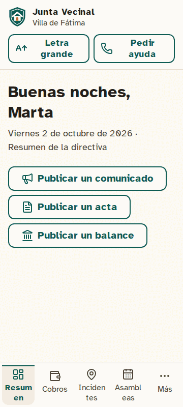 | 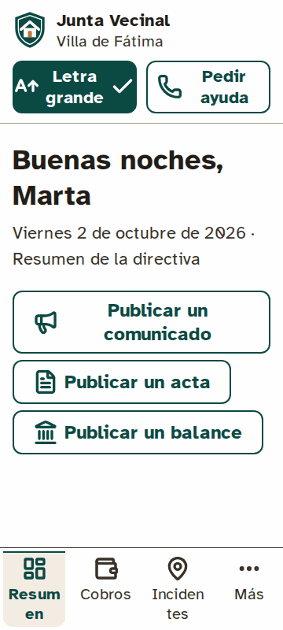 |
| DIR-ASA-14 Comunicado a la comunidad · paso 1 de 2 | 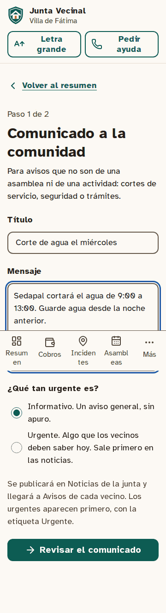 | 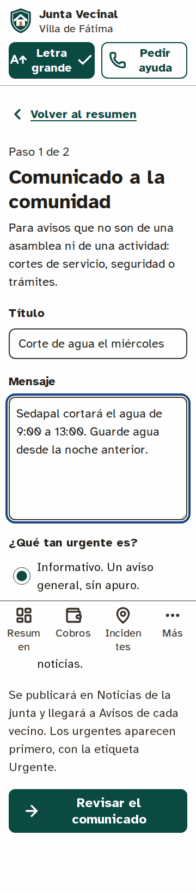 |
| DIR-ASA-15 Comunicado · paso 2 de 2 | 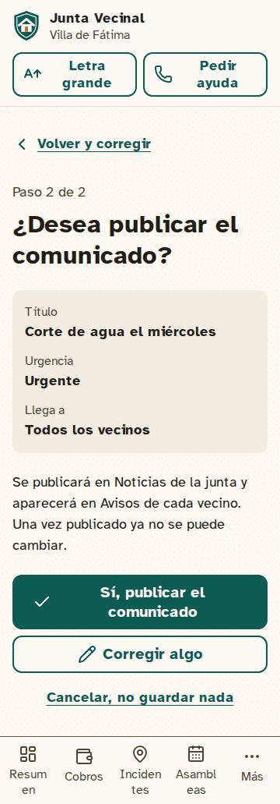 | 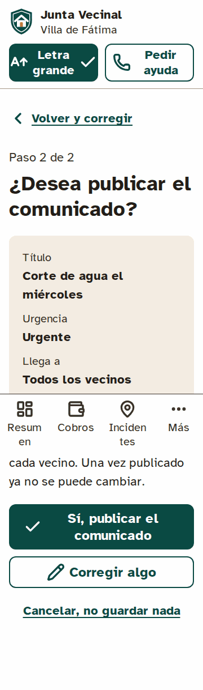 |
| DIR-ASA-10 Acta de la asamblea · paso 1 de 2 | 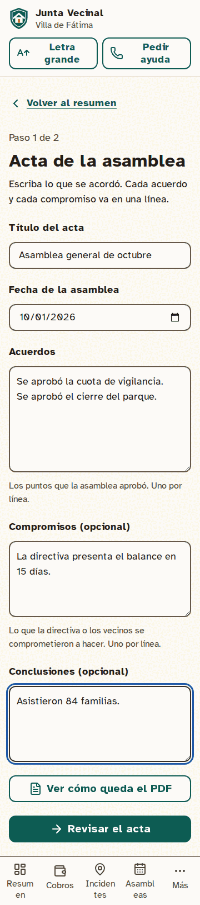 | 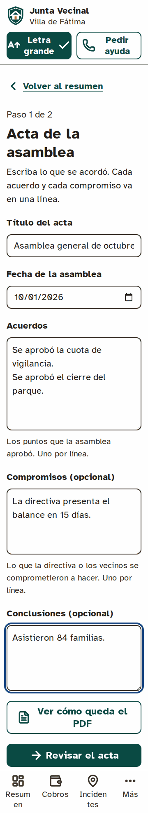 |
| DIR-ASA-11 Publicar acta · paso 2 de 2 | 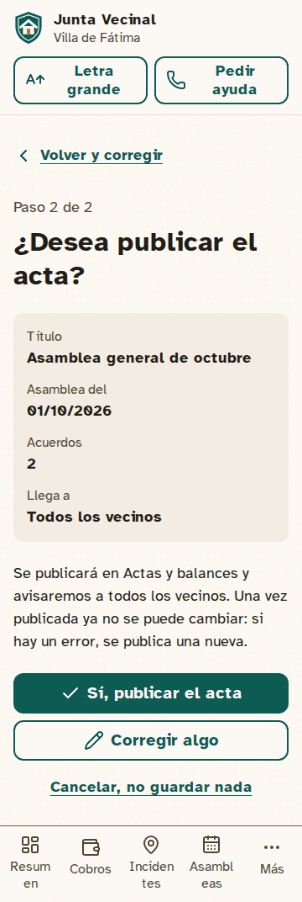 | 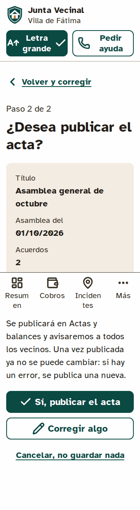 |
| DIR-ASA-12 Balance de una actividad (ingresos, gastos y gráfico) | 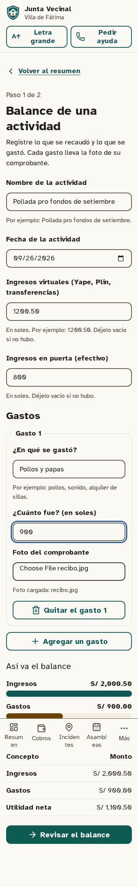 | 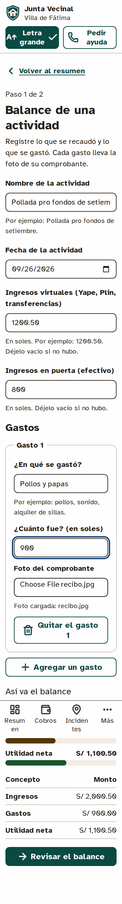 |
| DIR-ASA-13 Publicar balance · paso 2 de 2 | 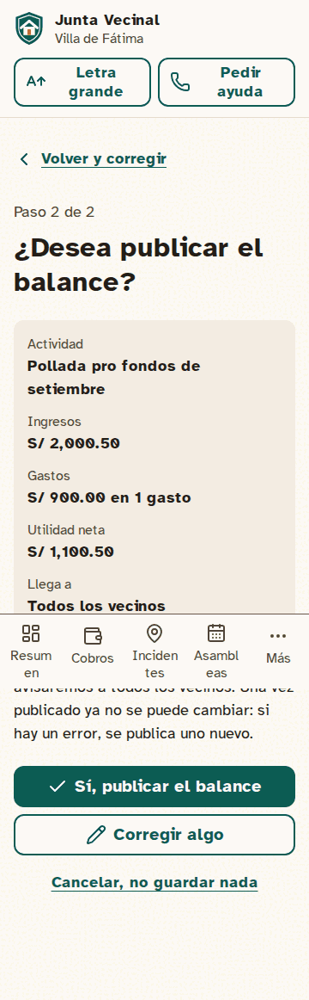 | 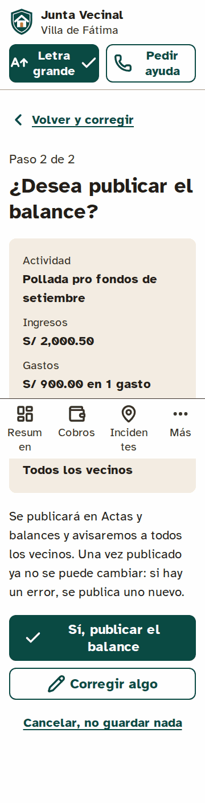 |
| VEC-ACC-09 Inicio (últimas noticias) | 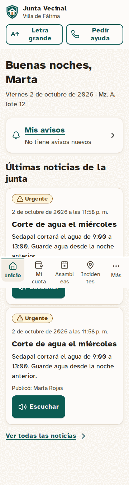 | 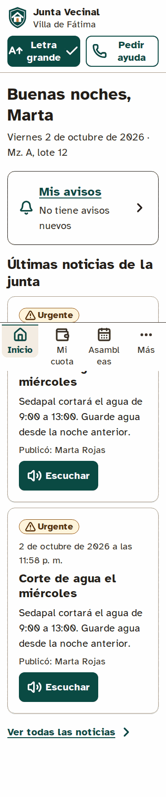 |
| VEC-TRA-04 Noticias de la junta (con lectura en voz) | 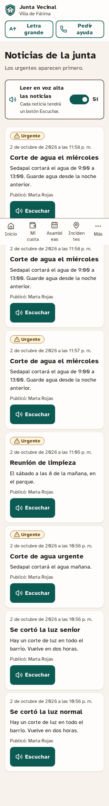 | 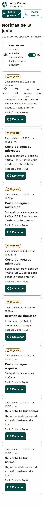 |
| VEC-TRA-02 Actas y balances | 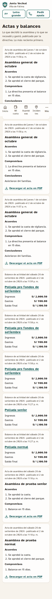 | 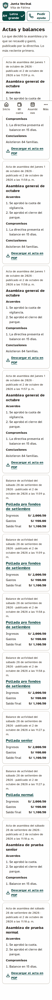 |
| VEC-TRA-03 Balance de una actividad | 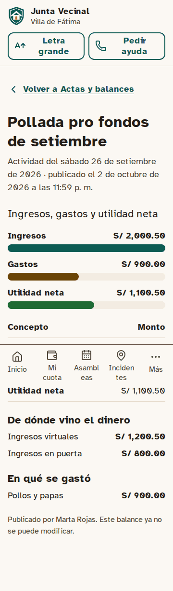 | 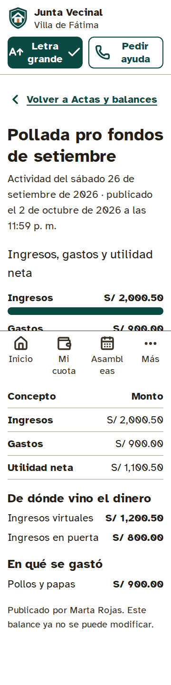 |
| VEC-AYU-03 Ayuda y accesibilidad | 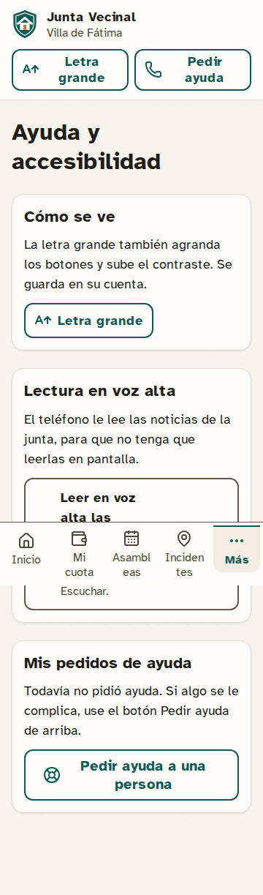 | 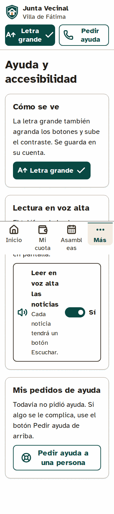 |

## 7. Diferido y decisiones

- **HU-COB-14 y HU-COB-15** pasan a M5, como dice el PLAN: sin cuotas ni pagos no hay recaudación que mostrar ni exportar.
- **Acta sin borradores:** el modelo habla de BORRADOR → APROBADA → PUBLICADA. Se implementó como en el prototipo: la confirmación en dos pasos de la directiva aprueba y publica a la vez. Si se quieren borradores guardados, es una HU nueva.
- **Comunicados sin WhatsApp:** solo llegan al centro de avisos. Para WhatsApp hace falta una plantilla nueva en Meta; por ahora la preferencia de noticias por WhatsApp está apagada por defecto.
- **Actas y balances sin M4:** se registran con título y fecha. En M4 se enlazarán a su asamblea o actividad.
- **R2 en producción:** la foto del comprobante necesita el bucket, el token, el CORS y las variables `R2_*` en Vercel (ya configurados por la autora). Pendiente probar una subida real.
- **Comprobantes:** solo los ven quien los subió y la directiva; un vecino ve concepto y monto de cada gasto.
- **Vercel preview:** vuelve a desplegar bien tras borrar las ramas de Neon de los PR cerrados (el límite de ramas era la causa). El paso de borrarlas quedó en `FLUJO_TRABAJO.md` §4.
- **Plantillas de WhatsApp de M1:** siguen en revisión de Meta; hasta su aprobación el canal es el simulador.
